[open-issues]: https://github.com/it-at-m/keycloak-require-role-authenticator-plugin/issues
[new-issue]: https://github.com/it-at-m/keycloak-require-role-authenticator-plugin/issues/new/choose
[license]: ./LICENSE
[new-issue-shield]: https://img.shields.io/badge/new%20issue-blue?style=for-the-badge
[made-with-love-shield]: https://img.shields.io/badge/made%20with%20%E2%9D%A4%20by-it%40M-yellow?style=for-the-badge
[license-shield]: https://img.shields.io/github/license/it-at-m/refarch?style=for-the-badge
[itm-opensource]: https://opensource.muenchen.de/

# keycloak-require-role-authenticator-plugin

[![New issue][new-issue-shield]][new-issue]
[![Made with love by it@M][made-with-love-shield]][itm-opensource]
[![GitHub license][license-shield]][license]

Plugin for requiring a specific header and value being present or not present.

This example has been taken from https://github.com/thomasdarimont/keycloak-extension-playground from the directory `auth-require-role-extension`
and ported to Keycloak v26.

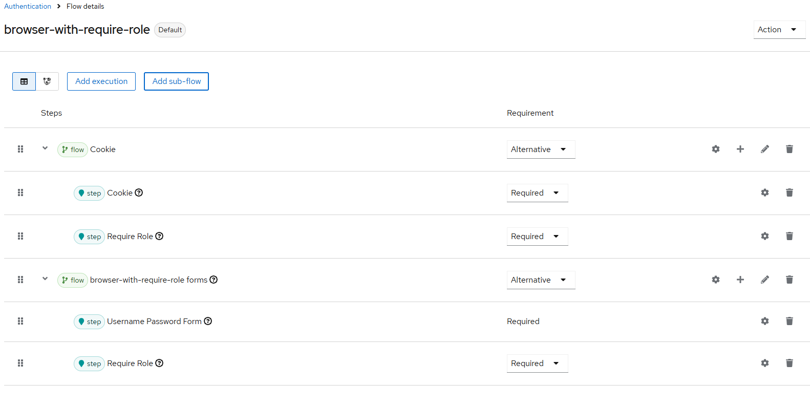

## Built With

- OpenJDK 21
- Keycloak 26

## Test

The following setup was tested:

- keycloak 26, Realm "muenchen.de"
- Clients: "client-a" with no client roles, "client-b" with client role "clientrole"
- User: user1 (PW: user1) und user2 (PW: user2); user1 has role "clientrole" from client "client-b"
- Browser-flow "browser-with-require-role" with execution "require role", which requires "${clientId}.clientrole"

Client A (no client role needed, "user1" and "user2" can log in)
https://localhost:8443/auth/realms/muenchen.de/protocol/openid-connect/auth?response_type=code&client_id=client-a&scope=openid%20profile%20email&state=1Gvul5jnemCt6KKoqP1nSDpDMPT6ZS-JgxEO0BUHESE%3D&redirect_uri=http%3A%2F%2Fwww.example.org&nonce=3HdXbB11Op2y0Exn-qIgyCS_F-2PaSkGaFPNoEqliCs

Client B (needs client role "clientrole", only "user1" can log in)
https://localhost:8443/auth/realms/muenchen.de/protocol/openid-connect/auth?response_type=code&client_id=client-b&scope=openid%20profile%20email&state=1Gvul5jnemCt6KKoqP1nSDpDMPT6ZS-JgxEO0BUHESE%3D&redirect_uri=http%3A%2F%2Fwww.example.org&nonce=3HdXbB11Op2y0Exn-qIgyCS_F-2PaSkGaFPNoEqliCs

## From the original readme

This example provides a custom `require-role` authenticator, that allows access to clients based on a client role.
The authenticator configuration supports a dynamic role expression to resolve the required role that a user needs
to have in order to access a client.

The role expression can be a fixed realm role, a fixed client role or a dynamic client role.
An expression without a dot is considered to be a realm role.

### Fixed realm role
The expression `user` would require that a user has the realm role `user` in order to access the application.

### Fixed client role
The expression `client1.user` would require that a user has the role `user` for `client1` in order to access the application.
If `client1` does not have the `user` role this check is ignored.

### Dynamic client role
The expression `${clientId}.user` would require that a user has the role `user` for the given target client in order to access the application.
If the target client does not have the `user` role this check is ignored.

## Configuration Example
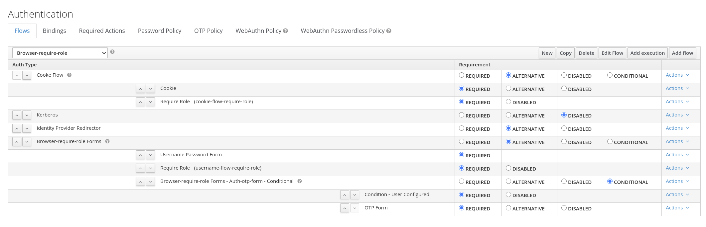

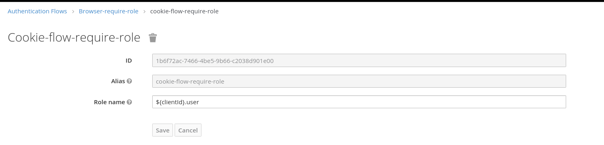

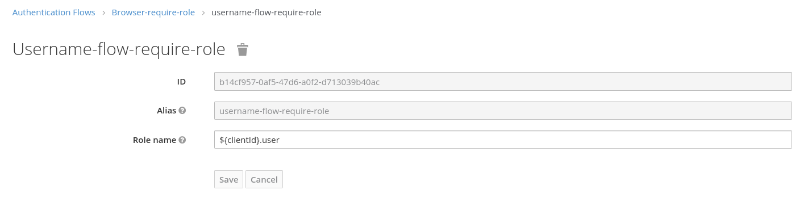

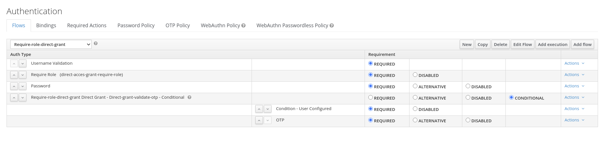

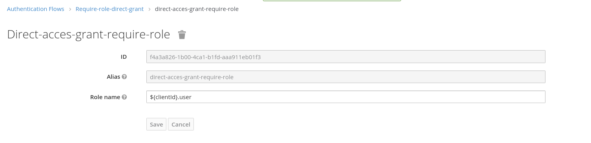

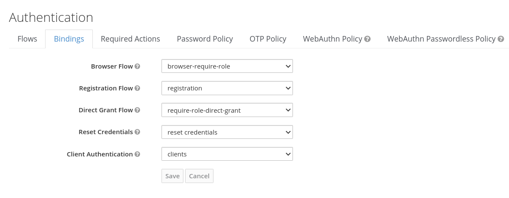

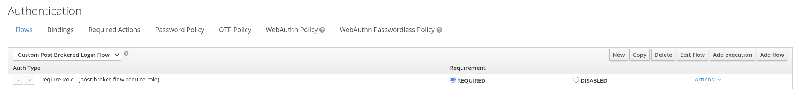

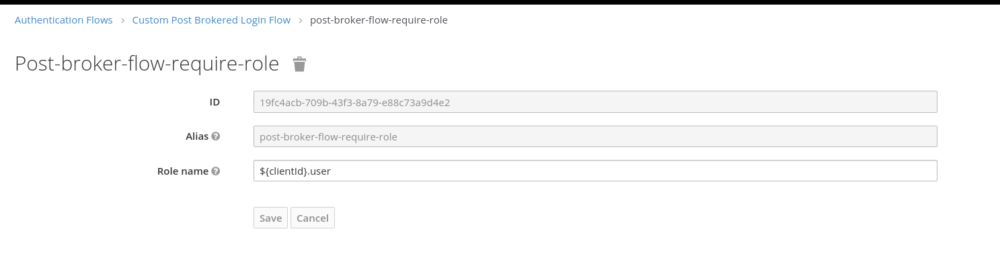

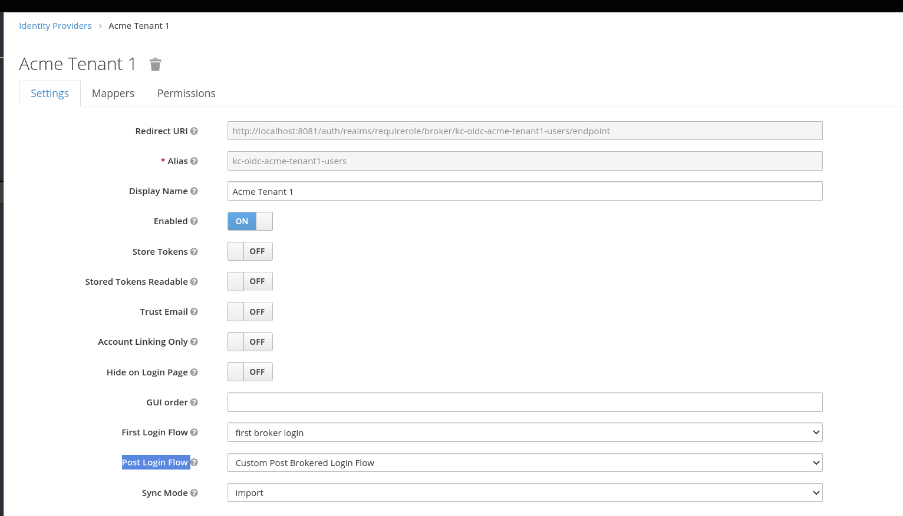

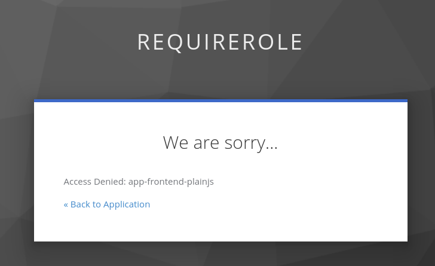

## Roadmap

See the [open issues][open-issues] for a full list of proposed features (and known issues).

## Contributing

Contributions are what make the open source community such an amazing place to learn, inspire, and create. Any contributions you make are **greatly appreciated**.

If you have a suggestion that would make this better, please open an issue with the tag "enhancement", fork the repo and create a pull request. You can also simply open an issue with the tag "enhancement".
Don't forget to give the project a star! Thanks again!

1. Open an issue with the tag "enhancement"
2. Fork the Project
3. Create your Feature Branch (`git checkout -b feature/AmazingFeature`)
4. Commit your Changes (`git commit -m 'Add some AmazingFeature'`)
5. Push to the Branch (`git push origin feature/AmazingFeature`)
6. Open a Pull Request

More about this in the [CODE_OF_CONDUCT](./.github/CODE_OF_CONDUCT.md) file.

## License

Distributed under the MIT License. See [LICENSE](LICENSE) file for more information.

## Contact

it@M - <opensource@muenchen.de>
